# Airbnb Web Application

A web application inspired by Airbnb ("Mini Airbnb") for browsing apartments and booking stays, developed as a university project.

## Overview

The website lists apartments grouped by country, lets users create an account and log in, view detailed apartment pages with photo tours, and make or cancel reservations.

## Features

- Apartment listings grouped by country (Lebanon, France, Turkey, Italy)
- User sign up and login
- Apartment details page with photo gallery, price, guest/bedroom/bath information, and description with "Show more"
- "What this place offers" amenities section with "Show all amenities"
- Photo tour page with photos grouped by room (living room, bedroom, bathroom, backyard, and more) and a full-screen photo viewer
- Reservation form with check-in date, check-out date, and number of guests
- Confirmation message after a successful reservation
- "My Reservations" page where users can view and cancel their bookings
- Logout with a confirmation prompt

## Technologies

- HTML
- CSS
- JavaScript
- PHP
- MySQL

## Screenshots

### Home Page
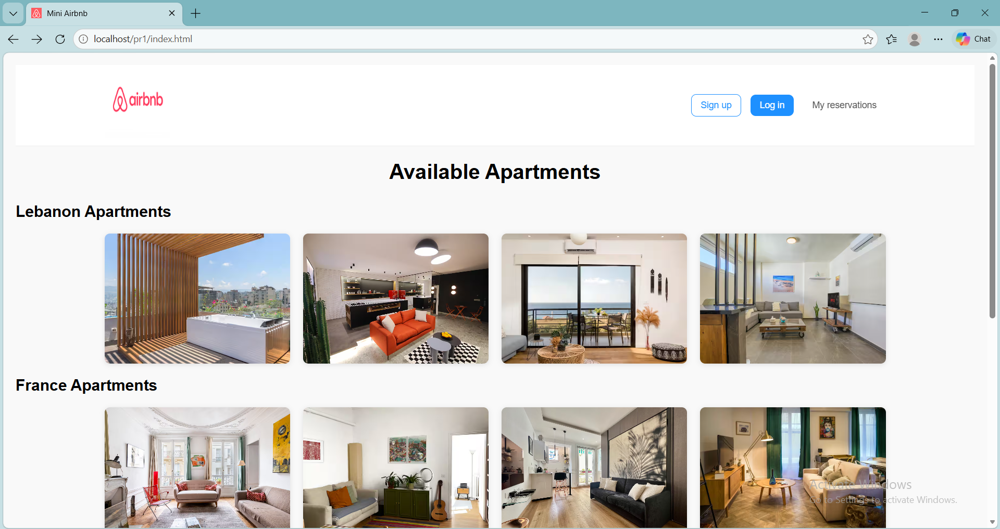
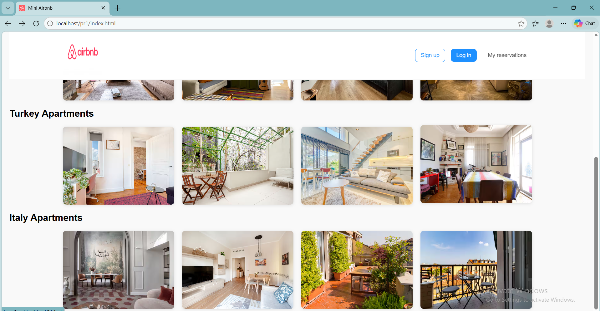

### Sign Up and Login
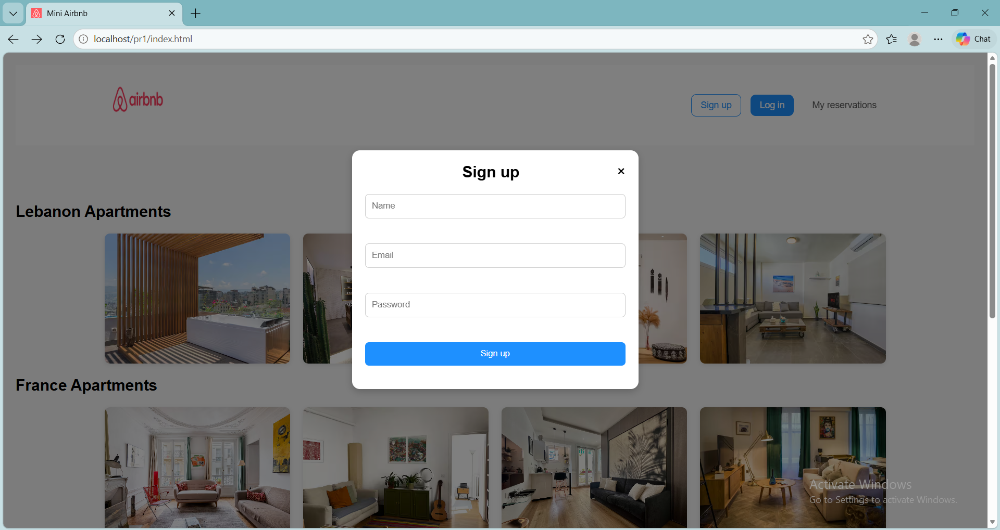 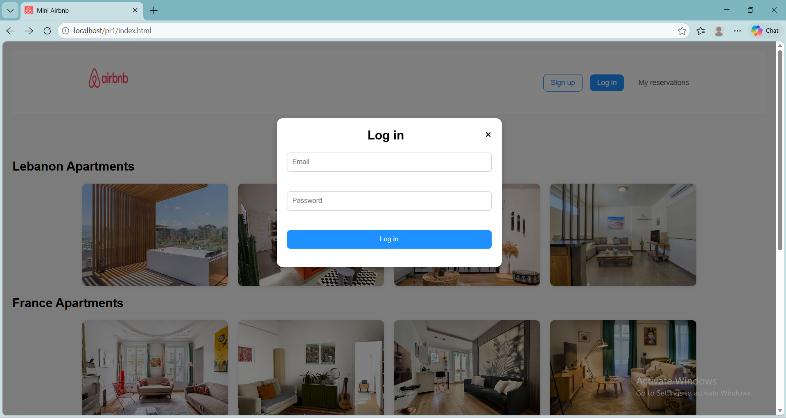
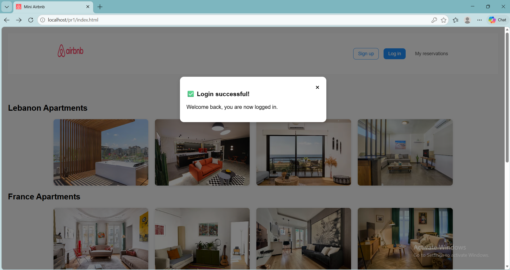

### Apartment Details
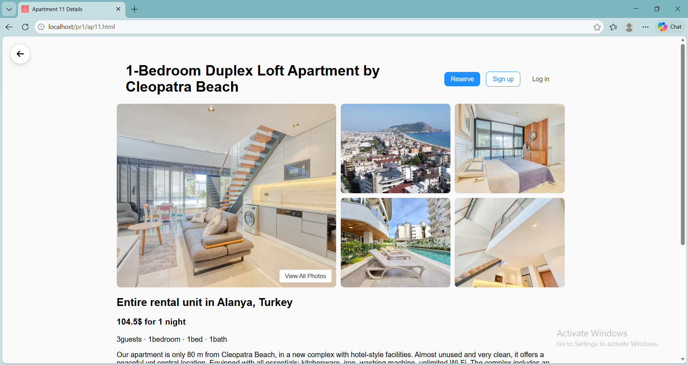
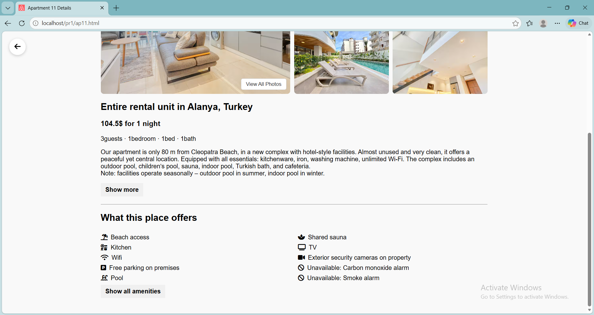

### Photo Tour
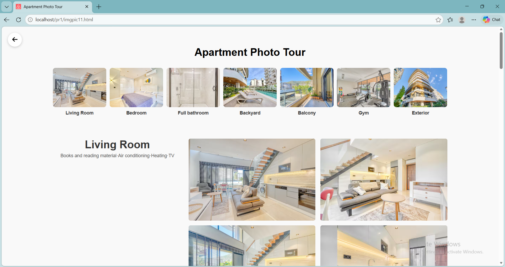
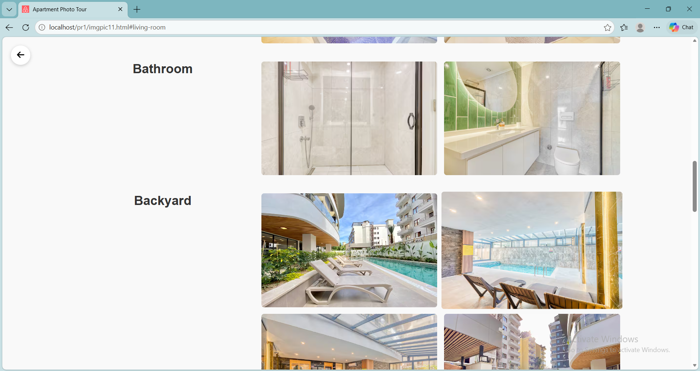
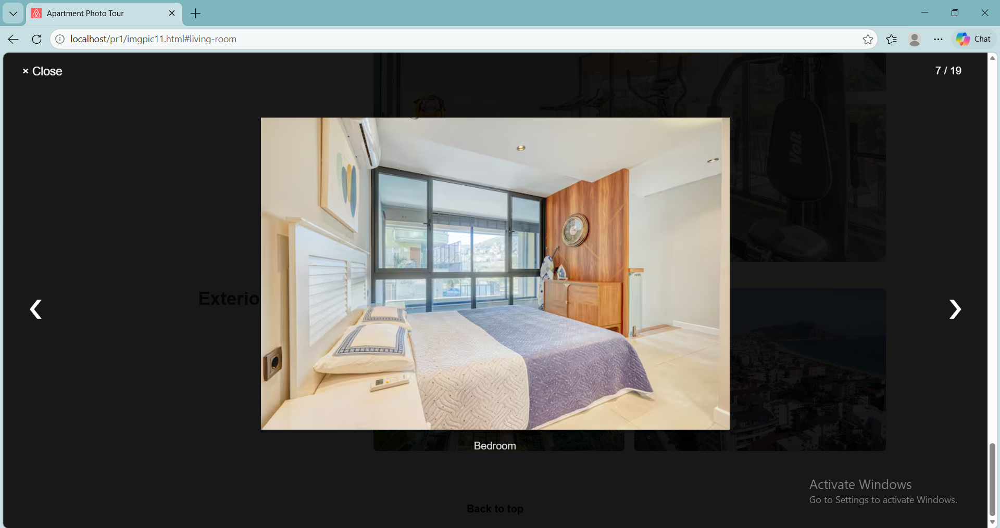

### Reservation
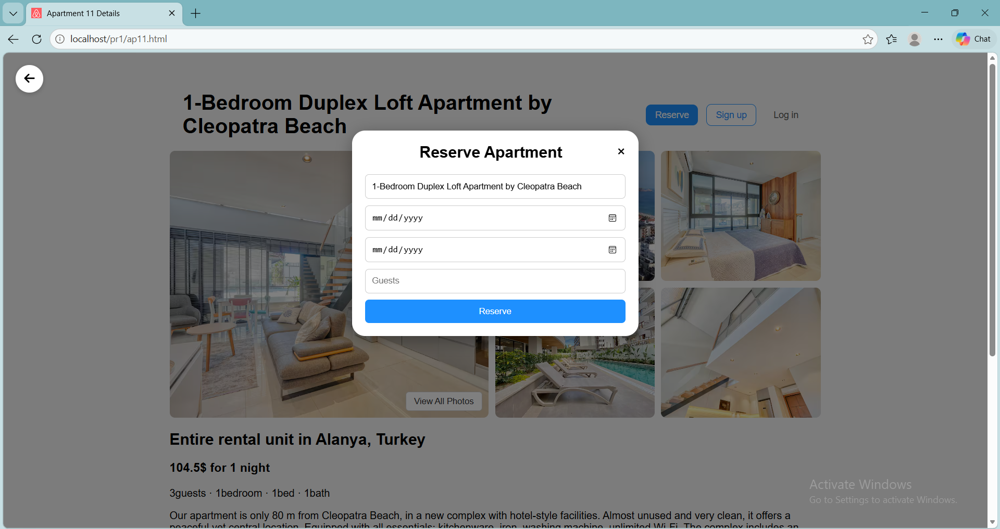 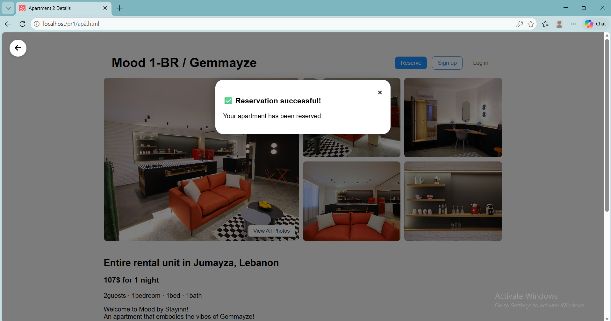

### My Reservations and Logout
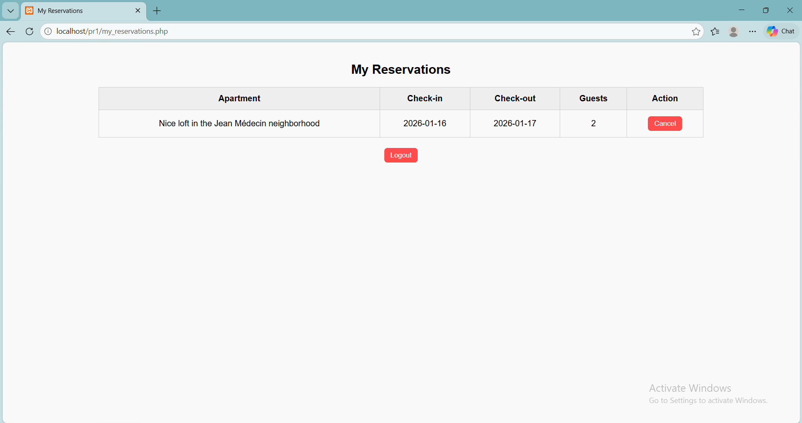 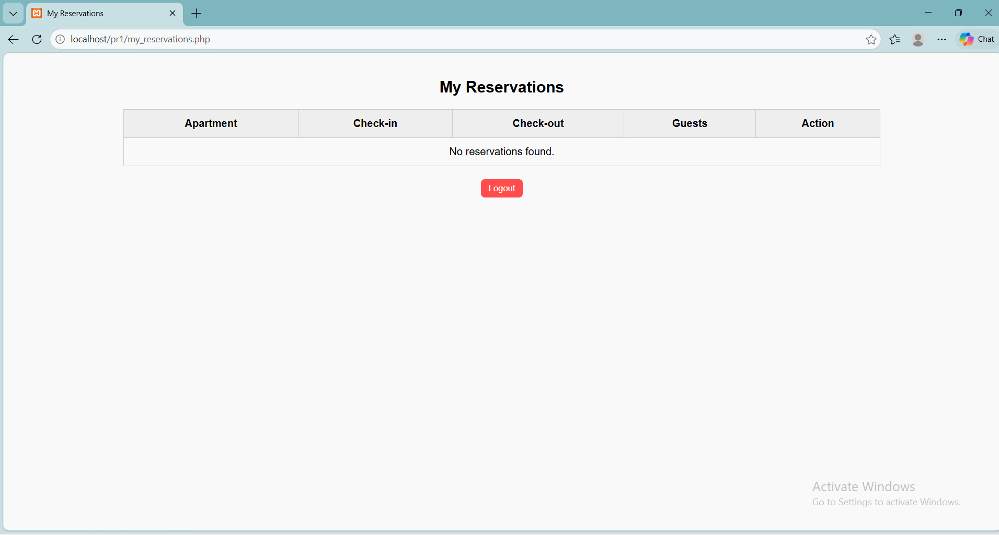
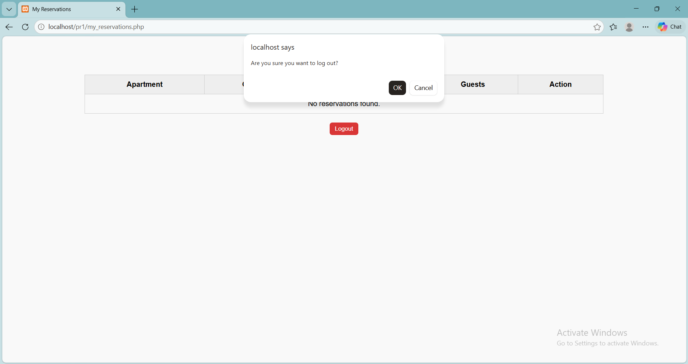

## Getting Started

1. Install XAMPP and start **Apache** and **MySQL**.
2. Open phpMyAdmin (`http://localhost/phpmyadmin`) and create a new database. Use the same name that appears in the PHP connection file of the project.
3. Import the `.sql` file included in this repository into that database.
4. Copy the project files into `C:\xampp\htdocs\pr1\`.
5. Open `http://localhost/pr1/index.html` in your browser.

## Author

**Farah Al Abdallah**

Computer Engineering Graduate
